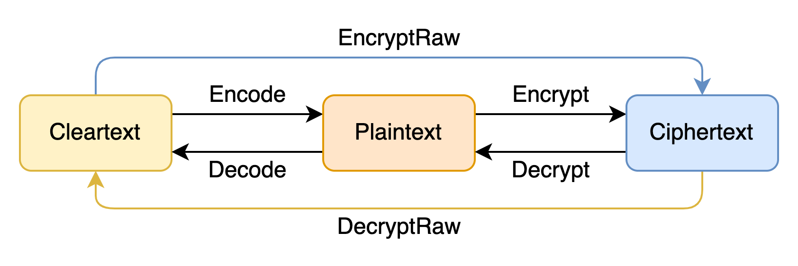

快速入门
=============

HEU 当前仅可作为加法同态加密 Library 使用，使用前请先参考 :doc:`安装说明 <./installation>` 安装 HEU Python 包。

.. note:: 本文所讲的内容全部位于 heu.phe 模块中

加解密
-------------

HEU 的操作对象有3种：

.. csv-table:: HEU 操作对象
   :header: "对象", "数据类型", "描述"

   Cleartext（原文）, python 原生数据类型, Python 原生的整数、浮点数
   Plaintext（明文）, phe.Plaintext, 编码后的原文，一定为整数
   Ciphertext（密文）, phe.Ciphertext, 密文

三种对象之间的转换方法如下：

HEU 基本使用展示

.. code-block:: python3
   :linenos:

   from heu import phe

   kit = phe.setup(phe.SchemaType.ZPaillier, 2048)
   encryptor = kit.encryptor()
   evaluator = kit.evaluator()
   decryptor = kit.decryptor()

   c1 = encryptor.encrypt_raw(3)
   c2 = encryptor.encrypt_raw(5)
   evaluator.add_inplace(c1, c2)  # c1 += c2

   decryptor.decrypt_raw(c1)  # output 8

.. note:: ``encrypt_raw`` 和 ``decrypt_raw`` 支持高精度，其精度与同态加密算法本身支持的值域范围相同，具体值域因算法而异，但一般都 **远大于** C++ int128 表达范围。

编码
-----------------

当前 HEU 提供了四种 ``Encoder``：

- ``phe.IntegerEncoder``: 编码 128bits 以内的整数
- ``phe.FloatEncoder``: 编码双精度浮点数
- ``phe.BigintEncoder``: 编码高精度整数，支持任意精度
- ``phe.BatchEncoder``: 将两个原文（整数）编码到一个明文中

创建 Encoder 的方法（以``phe.IntegerEncoder``为例）

方法一：

.. code-block:: python3

   encoder = phe.IntegerEncoder(phe.SchemaType.ZPaillier)

方法二：

.. code-block:: python3

   kit = phe.setup(phe.SchemaType.ZPaillier, 2048)
   encoder = phe.IntegerEncoder(kit.get_schema())

方法三：

.. code-block:: python3

   kit = phe.setup(phe.SchemaType.ZPaillier, 2048)
   encoder = kit.integer_encoder()

IntegerEncoder 和 FloatEncoder
^^^^^^^^^^^^^^^^^^^^^^^^^^^^^^

``phe.IntegerEncoder`` 和 ``FloatEncoder`` 原理类似，都是将原文乘上一个 scale 后转换成明文，因此 scale 大小决定了计算的精度。如果创建 ``IntegerEncoder/FloatEncoder`` 对象时不提供参数，则使用默认的 scale ``1e6``

.. warning:: ``phe.IntegerEncoder`` 有数值大小上限，请确保编码后的明文小于 128 比特

.. warning:: ``phe.FloatEncoder`` 有数值大小上限，请确保编码后的明文大小在双精度浮点数（double）表示范围内

.. code-block:: python3
   :linenos:

   from heu import phe

   encoder = phe.IntegerEncoder(phe.SchemaType.ZPaillier)
   pt = encoder.encode(3.5)
   print(type(pt))  # heu.phe.Plaintext
   print(pt)  # 3000000
   print(encoder.decode(pt))  # 3

   encoder = phe.FloatEncoder(phe.SchemaType.ZPaillier)
   pt = encoder.encode(3.5)
   print(encoder.decode(pt))  # 3.5

BigintEncoder
^^^^^^^^^^^^^^^

``BigintEncoder`` 类似于 ``IntegerEncoder(scale=1)``，但不受精度限制，支持编码任意精度的整数，为了方便用户使用，BigintEncoder 是隐式的，如果用户没有指定 encoder，都默认使用该 encoder。

.. note:: ``BigintEncoder`` 编码 int128 原文性能非常高，但是超过 128bits 后性能会有显著降低

.. code-block:: python3
   :linenos:

   from heu import phe

   encoder = phe.BigintEncoder(phe.SchemaType.ZPaillier)
   int64_max = 9223372036854775807
   pt = encoder.encode(int64_max**10)
   print(encoder.decode(pt) == int64_max**10)  # True

BatchEncoder
^^^^^^^^^^^^^^^

``phe.BatchEncoder`` 支持将两个原文（Cleartext，int64整数）打包加密到一个明文（Plaintext）中，实现 SIMD 功能。

.. warning:: ``phe.BatchEncoder`` 有数值大小上限，每个原文不大于 64 比特

.. caution:: BatchEncoder 并不完全兼容密态减法，仅当密文中所有元素都是正整数时才可以使用，如果您无法确定元素数值范围，应当避免使用密态减法。

.. code-block:: python3
   :linenos:

   from heu import phe

   kit = phe.setup(phe.SchemaType.ZPaillier, 2048)
   encryptor = kit.encryptor()
   evaluator = kit.evaluator()
   decryptor = kit.decryptor()

   bc = kit.batch_encoder()
   pt1 = bc.encode(123, 456)
   pt2 = bc.encode(789, 101112)

   ct1 = encryptor.encrypt(pt1)
   ct2 = encryptor.encrypt(pt2)

   # output: (912, 101568)
   print(bc.decode(decryptor.decrypt(evaluator.add(ct1, ct2))))
   # When using batch encoding, please pay special attention to subtraction,
   # which can only be used when all elements in ciphertext are positive integers.
   # output: (-666, -100656)
   print(bc.decode(decryptor.decrypt(evaluator.sub(ct1, ct2))))

持久化
---------------

实际场景中，隐私计算往往涉及多个参与方，这就涉及到对象的序列化和反序列化，HEU 的对象持久化功能依赖 Pickle。

在一个典型的使用场景中，Client 是数据提供方，Server 是算力提供方，Client 并不信任 Server，因此 Client 可以把数据加密发送给 Server，Server 在密文数据上做计算，并把结果返回给 Client。

.. code-block:: python3
   :linenos:

   import pickle
   from heu import phe

   # client: encrypt
   client_he = phe.setup(phe.SchemaType.ZPaillier, 2048)
   pk_buffer = pickle.dumps(client_he.public_key())

   ct1_buffer = pickle.dumps(client_he.encryptor().encrypt_raw(123))
   ct2_buffer = pickle.dumps(client_he.encryptor().encrypt_raw(456))

   # server: calc ct1 - ct2
   # server_he supports encryption and cryptographic operations, but doesn't support decryption
   server_he = phe.setup(pickle.loads(pk_buffer))
   ct3 = server_he.evaluator().sub(pickle.loads(ct1_buffer), pickle.loads(ct2_buffer))
   ct3_buffer = pickle.dumps(ct3)

   # client: decrypt
   ct_x = pickle.loads(ct3_buffer)
   print(client_he.decryptor().decrypt_raw(ct_x))  # -333
