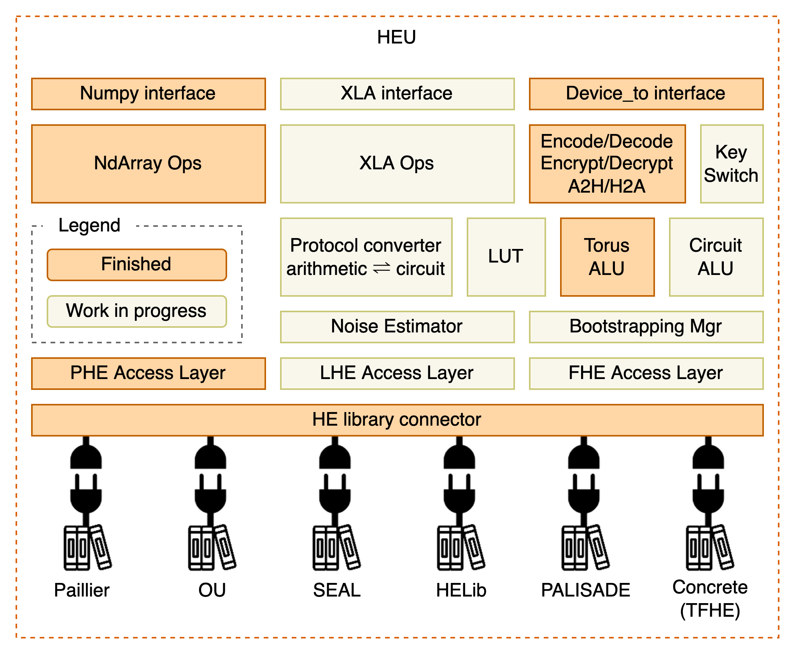

.. HEU documentation master file, created by
   sphinx-quickstart on Mon Jun 27 17:06:46 2022.
   You can adapt this file completely to your liking, but it should at least
   contain the root `toctree` directive.

HEU 文档
===============================

同态加密计算引擎（homomorphic encryption processing unit, HEU) 是隐语的一个子项目，实现了高性能的同态加密算法。

HEU 的目的是降低同态加密的使用门槛，使得用户无需专业知识就能利用同态加密算法构建任意程序。

由于 HEU 还处在起步阶段，当前 HEU 仅仅是一个加法同态加密的 library，还不俱备像 SPU 一样执行任意程序的能力。

.. toctree::
   :maxdepth: 2
   :caption: Contents

   getting_started/index
   references/phe_api

