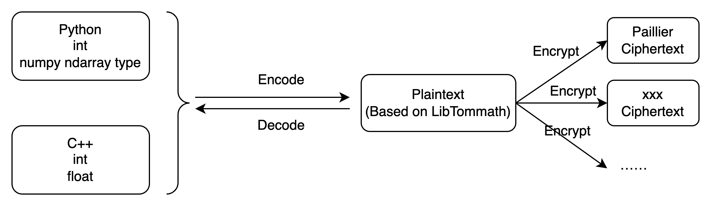
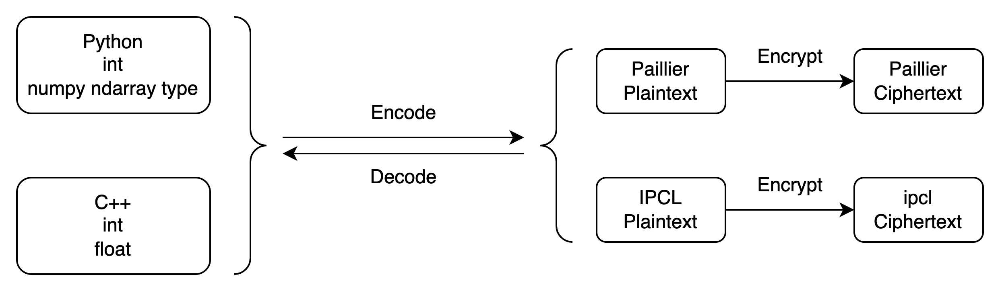
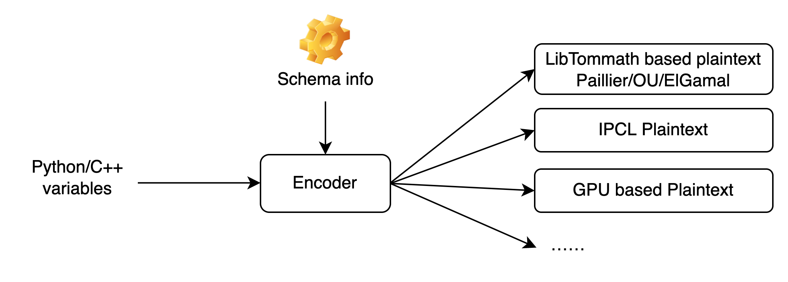

升级指南
================

.. raw:: html

    

.. role:: red
.. role:: blue

HEU 0.2.x → 0.3.x
------------------

背景解释
^^^^^^^^^^^^^^^^^^

HEU 0.2 版本与大整数运算库 Libtommath 强绑定，要求所有算法算法必须基于 Libtommath 开发，这就限制了算法的发展空间，为了支持更多种类的算法，HEU 0.3 版本对底层架构做了较大升级，将 Libtommath 与 HE 算法完全解耦，不再约定算法底层的实现细节，从而使得算法开发者有更大的发挥空间。

:red:`Before`：0.2.x 的加解密流程

Encoder 先把原始数据类型转换成 LibTommath 中的 MPInt 对象（即 Plaintext），再由不同 HE 算法将 MPInt Plaintext 转换成相应的 Ciphertext。

:blue:`After`：0.3.x 的加解密流程

Encoder 直接把原始数据类型转换成算法对应的 Plaintext，不同算法定义的 Plaintext 底层允许有完全不同的数据结构。

Encoder 为了生成正确的 Plaintext，需要额外引入 Schema 信息：

API 变更
^^^^^^^^^^^^^^^^^^^

主要变化在于创建 Plaintext 需要传入 Schema 信息

Scalar 操作

.. code-block:: python3
   :linenos:

   from heu import phe
   kit = phe.setup(phe.SchemaType.ZPaillier, 2048)

   # Create plaintext object via encoder (recommend)
   # Create encoder:
   # Before: edr = phe.BigintEncoder()
   # Now:
   edr = phe.BigintEncoder(kit.get_schema())
   # Or:
   edr = kit.bigint_encoder()
   pt = edr.encode(123456789)

   # Create plaintext object directly
   # Before: phe.Plaintext(123)
   # Now:
   phe.Plaintext(kit.get_schema(), c)

矩阵操作

.. code-block:: python3
   :linenos:

   from heu import numpy as hnp
   from heu import phe
   kit = hnp.setup(phe.SchemaType.ZPaillier, 2048)

   # Create plaintext matrix (solution 1)
   # Before: pt = hnp.array([1, 2, 3])
   # Now:
   pt = kit.array([1, 2, 3])

   # Create plaintext matrix (solution 2)
   # Before: pt = hnp.array([1, 2, 3], phe.IntegerEncoder())
   # Now:
   pt = hnp.array([1, 2, 3], kit.IntegerEncoder(scale=100))
   # Or:
   pt = hnp.array([1, 2, 3], phe.IntegerEncoder(kit.get_schema(), scale=100))
   # Or:
   pt = kit.array([1, 2, 3], phe.IntegerEncoderParams(scale=100))

